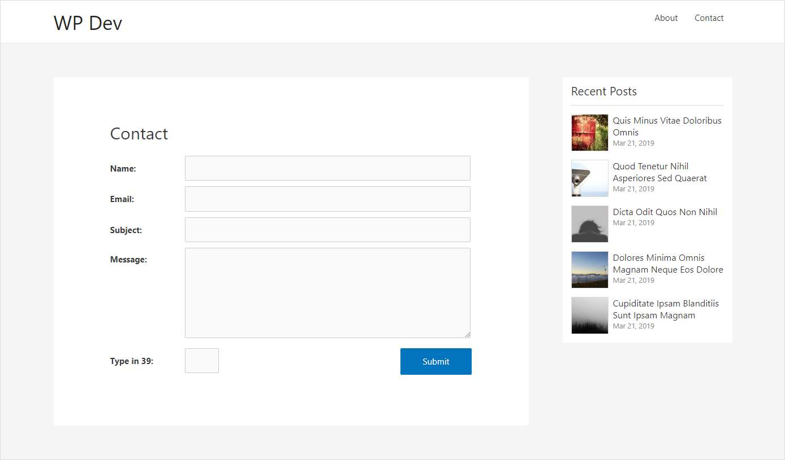
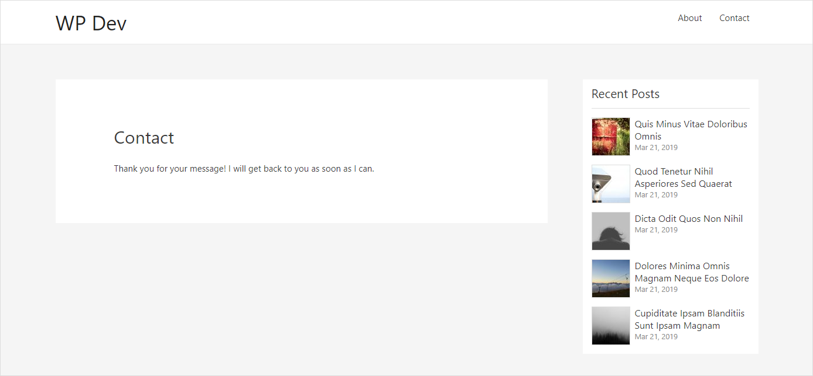

# Description

Plain Contact is a WordPress plugin to create a simple contact form via the [plaincontact] shortcode that you add to the content area of your page/post. 

The form comes with input sanitization and validation (including nonce), error checking and messages, as well as basic spam blocking mechanism via a simple math capthca. Messages submitted will be sent to the site admin email defined in WordPress General settings page.

# Screenshots

