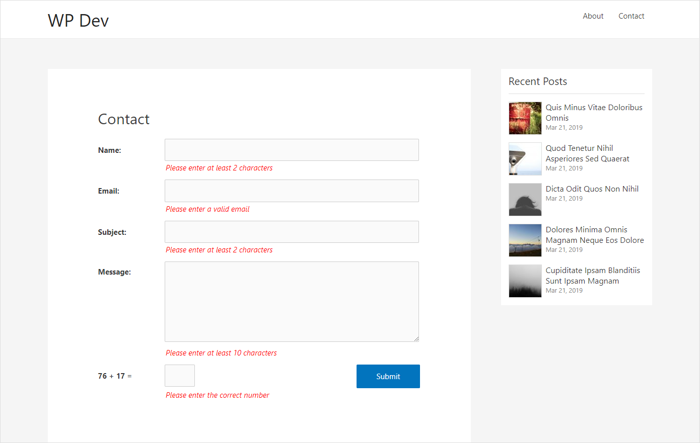

# Description

Plain Contact is a WordPress plugin to create a simple contact form via the [plaincontact] shortcode that you add to the content area of your page/post. 

The form comes with input sanitization and validation, error checking and messages, as well as basic spam blocking mechanism. Messages submitted will be sent to the site admin address defined in WordPress General settings page.

# Screenshots

